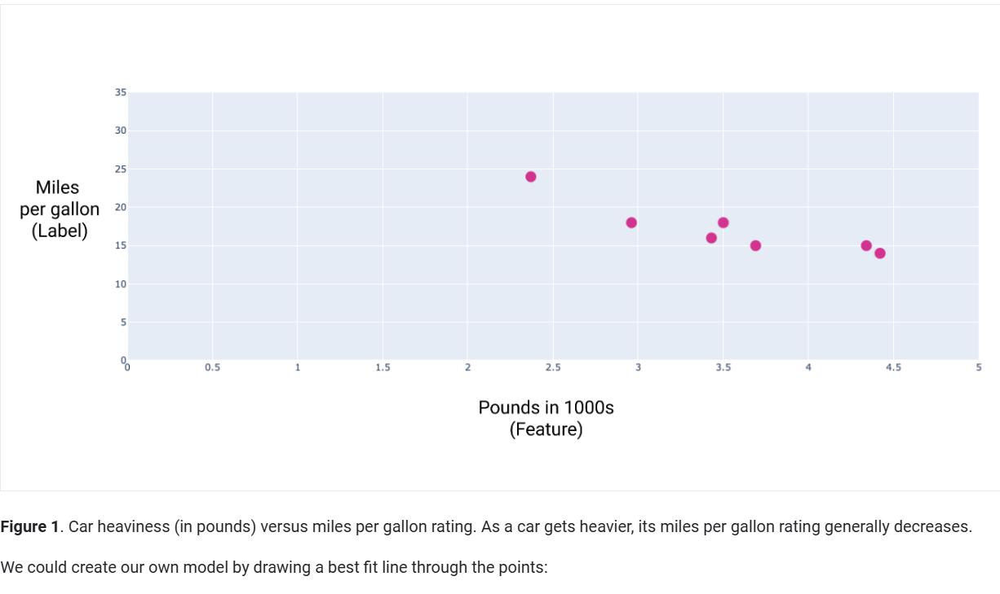
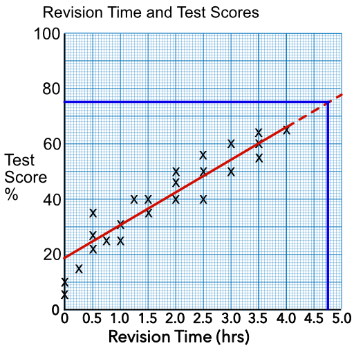
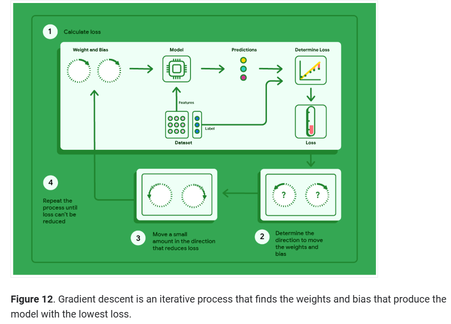

# 📈 Linear Regression  

Linear Regression is a foundational concept in machine learning, used to model the relationship between input features and a target variable. This module explains its core concepts, real-world applications, and training techniques.

---

## 🎯 Learning Objectives  
By the end of this module, you will be able to:  
1. Explain what a **loss function** is and how it measures model performance.  
2. Understand how **gradient descent** optimizes model parameters.  
3. Learn to tune **hyperparameters** for efficient training.  
4. Implement a simple linear regression model.

---

## 🏎 Real-World Example: Car Weight vs. Fuel Efficiency  
Linear regression can predict a car's fuel efficiency based on its weight.  
For example:  

| **Pounds (x1000)** | **Miles per Gallon (MPG)** |
|---------------------|---------------------------|
| 3.5                 | 18                        |
| 4.42                | 14                        |
| 2.37                | 24                        |

### Figure 1: Data Points  
  
*As cars get heavier, their fuel efficiency typically decreases.*  


## 📐 Mathematical Foundation  

### Single-Feature Linear Model  
The relationship between the input `x` (feature) and the output `y` (label) is represented as:  y = wx + b
Where:  
- `y`: Predicted output (label).  
- `x`: Input feature.  
- `w`: Weight (slope of the line).  
- `b`: Bias (y-intercept).

### Multi-Feature Linear Model  
For models with multiple features, the equation becomes:  y = w1x1 + w2x2 + ... + wnxn + b
Where:  
- `x1, x2, ... xn`: Features.  
- `w1, w2, ... wn`: Corresponding weights.  

### Example: Predicting Fuel Efficiency  
For a car with a weight of 4,000 pounds, using the model:  y = -3.6x + 30
The predicted fuel efficiency:  y = -3.6 * 4 + 30 = 15.6 MPG
```

## 🎓 Training a Linear Model  

### 1. **Loss Function**  
A **loss function** measures how far off a model's predictions are from the actual values. For linear regression, the common loss function is Mean Squared Error (MSE):  MSE = (1/N) Σ (y - y')^2
Where:  
- `y`: Actual label.  
- `y'`: Predicted label.  
- `N`: Number of data points.  

### 2. **Gradient Descent**  
**Gradient Descent** adjusts the weights and bias to minimize the loss function. It works by iteratively updating parameters:  
w = w - α * ∂L/∂w  
b = b - α * ∂L/∂b 
Where:  
- `α`: Learning rate.  
- `∂L/∂w, ∂L/∂b`: Gradients of the loss function.

### 3. **Hyperparameter Tuning**  
Key hyperparameters for linear regression include:  
- **Learning Rate (α)**: Controls step size during gradient descent.  
- **Number of Iterations**: Determines training duration.

---

## 📊 Visualizations  

### Figure 2: Best Fit Line  
  
*The optimal line minimizes the distance to all data points.*

### Figure 3: Gradient Descent Visualization  
  
*Gradient descent finds the optimal weights and bias by iteratively minimizing the loss function.*

---

## 🔧 Implementation  

### Python Code Example  
```python
import numpy as np
from sklearn.linear_model import LinearRegression

# Dataset
X = np.array([[3.5], [4.42], [2.37]])
y = np.array([18, 14, 24])

# Create and train the model
model = LinearRegression()
model.fit(X, y)

# Predict
new_data = np.array([[4.0]])
prediction = model.predict(new_data)
print(f"Predicted MPG for 4,000 pounds: {prediction[0]}")
```

---

## 🔑 Key Terms  
- **Bias**: The y-intercept in the linear equation.  
- **Feature**: Input variable used for prediction.  
- **Gradient Descent**: Optimization algorithm to minimize the loss function.  
- **Loss Function**: Quantifies the error of the model.  
- **Weight**: Slope of the line representing the feature's impact on the label.  

---

## 📂 Resources  
1. [Google ML Crash Course - Linear Regression](https://developers.google.com/machine-learning/crash-course/linear-regression)  
2. [Linear Regression on Wikipedia](https://en.wikipedia.org/wiki/Linear_regression)  
3. [Interactive Gradient Descent Visualization](https://ml-playground.com)  

## 🧩 Exercises  
1. **Explain the role of weights and bias in the linear regression equation.**  
2. **Why is the loss function important in training a linear model?**  
3. **What happens if the learning rate is too high or too low?**  


## ⚖️ License and Attribution  
This content is inspired by the [Google ML Crash Course](https://developers.google.com/machine-learning/crash-course) and follows the Creative Commons Attribution 4.0 License.  

---

## 🙌 Contributing  
Want to improve this guide? Feel free to fork the repository and submit a pull request!  
```

---

### **Additional Suggestions**
1. **Include Step-by-Step Tutorials**: Add beginner-friendly exercises for implementing linear regression models from scratch and using libraries like Scikit-learn.  
2. **Interactive Visuals**: Link to tools for interactive model visualization (e.g., Gradient Descent simulators).  
3. **Community Involvement**: Add a section for users to share feedback and contribute.  
4. **Expand Topics**: Over time, add more sections like logistic regression, overfitting, and regularization.
